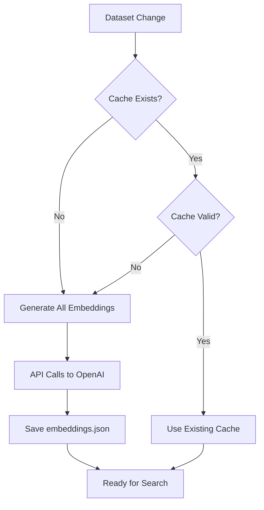
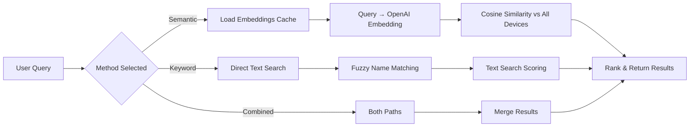

# Medical Device Smart Search

A smart search tool for medical device inventory that combines semantic similarity search with traditional keyword matching to handle typos and descriptive queries.

## Features

- **Semantic Search**: Uses AI embeddings to understand meaning and context
- **Keyword Search**: Fuzzy matching on device names with typo tolerance
- **Combined Search**: Best results from both approaches
- **Web Demo**: Streamlit app for easy testing and demonstration
- **Modular Design**: Easy to swap embedding providers or add new search methods
- **Comprehensive Dataset**: 49 medical devices including size variations and surgical instrument families

## Deployment

### Local Development

1. Install dependencies:
   ```bash
   pip install -r requirements.txt
   ```

2. Set up environment variables:
   ```bash
   export OPENAI_API_KEY=your_openai_api_key
   ```

3. Run the app:
   ```bash
   streamlit run app.py
   ```

### Cloud Deployment with Access Control

This app includes authentication for controlled access. To deploy on Streamlit Cloud:

1. **Prepare the Repository**:
   - Push your code to a GitHub repository
   - Ensure `requirements.txt` includes `streamlit-authenticator`

2. **Set Up Secrets**:
   - In your repository, create `.streamlit/secrets.toml` (see example in `.streamlit/secrets.toml`)
   - **Important**: Do NOT commit `secrets.toml` to version control
   - Instead, set secrets via Streamlit Cloud dashboard or GitHub secrets

3. **Generate Hashed Passwords**:
   ```python
   import streamlit_authenticator as stauth
   hashed_passwords = stauth.Hasher(['password1', 'password2']).generate()
   print(hashed_passwords)
   ```
   Use these hashes in your secrets.

4. **Deploy on Streamlit Cloud**:
   - Go to [share.streamlit.io](https://share.streamlit.io)
   - Connect your GitHub account
   - Select your repository and branch
   - Set main file path to `app.py`
   - Add secrets in the advanced settings:
     - `auth.user1_password`: hashed password for user1
     - `auth.user2_password`: hashed password for user2
     - `auth.user1_email`: user1@example.com
     - `auth.user1_name`: User One
     - `openai.api_key`: your_openai_api_key
     - And similar for other users

5. **Share the Link**:
   - Once deployed, share the generated URL with authorized users
   - Users will need the username/password you provide to access the app

### Access Control

- The app uses `streamlit-authenticator` for login
- User sessions are managed with cookies
- Only pre-authorized users can access the app
- Add/remove users by updating the secrets configuration

## Usage
    end

    subgraph "OpenAI Integration"
        Z[OpenAI API] --> AA[text-embedding-3-small]
        AA --> BB[Generate Device Embeddings]
        BB --> CC[Generate Query Embeddings]
        CC --> DD[Cosine Similarity Calculation]
    end
```

## How It Works

### Dataset Management
- **Static Dataset**: The `devices.json` file contains all medical device information
- **Embedding Caching**: Device embeddings are generated once and cached in `embeddings.json`
- **Change Detection**: Embeddings are only regenerated when the dataset changes
- **Performance**: Cached embeddings enable fast semantic search without repeated API calls

### Search Process

#### 1. Query Processing
- User enters text query (e.g., "heart monitor", "oxygen device")
- System supports three search methods: Combined, Semantic, or Keyword

#### 2. Semantic Search (OpenAI Integration)
- **When Used**: Requires OpenAI API key and `text-embedding-3-small` model
- **Process**:
  1. Convert query to embedding vector using OpenAI
  2. Compare against cached device embeddings
  3. Calculate cosine similarity scores
- **Formula**: `similarity = cos(θ) = (A·B) / (||A|| × ||B||)`
- **Range**: Scores from -1 (opposite) to 1 (identical)

#### 3. Keyword Search (Local Processing)
- **Always Available**: No API key required
- **Scoring Components**:
  - **Exact Match**: 1.0 (perfect match)
  - **Partial Match**: 0.8 (query substring in device name)
  - **Fuzzy Match**: 0.0-0.6 (difflib sequence matching)
  - **Keyword Match**: 0.0-0.3 (query words in description/use)
- **Combined Score**: Weighted average of all matching criteria

#### 4. Result Ranking
- **Combined Search**: Merges semantic and keyword results, removes duplicates
- **Top Results**: Returns best 3 matches by relevance score
- **Match Types**: Exact Name, Fuzzy Name, Keyword Match, Semantic Match

### OpenAI Usage Points
1. **Device Embedding Generation**: Convert device descriptions to vectors (one-time)
2. **Query Embedding**: Convert search queries to vectors (per search)
3. **Model**: `text-embedding-3-small` (1536 dimensions)
4. **Caching**: Results stored locally to minimize API calls

## Technical Details

### Similarity Score Calculation

#### Semantic Search (Cosine Similarity)
```
For each device, calculate: similarity = cos(θ) = (query_vector · device_vector) / (||query_vector|| × ||device_vector||)

Where:
- query_vector: OpenAI embedding of search query (1536 dimensions)
- device_vector: Pre-computed OpenAI embedding of device text
- Range: -1.0 (completely opposite) to 1.0 (identical meaning)
- Typical scores: 0.7-0.9 for good matches, 0.3-0.6 for related matches
```

#### Keyword Search (Weighted Scoring)
```
Total Score = (Name_Match × 0.7) + (Description_Match × 0.2) + (Use_Match × 0.1)

Name_Match:
- Exact match: 1.0
- Partial match: 0.8
- Fuzzy match: difflib.ratio() × 0.6 (0.0-0.6)

Description/Use_Match:
- Contains query: 1.0
- No match: 0.0
```

#### Combined Search Algorithm
1. Run both semantic and keyword searches
2. Remove duplicate devices (keep highest score)
3. Sort by similarity score descending
4. Return top 3 results

### Embedding Process

#### Initial Setup (One-time)
```python
# 1. Load devices from JSON
devices = load_devices("devices.json")

# 2. Generate embeddings for all devices
for device in devices:
    text = f"{device.name}. {device.description}. {device.use}"
    embedding = openai.Embedding.create(model="text-embedding-3-small", input=text)
    cache[device.id] = embedding

# 3. Save to embeddings.json
save_cache(cache, "embeddings.json")
```

#### Runtime Search
```python
# 1. Load cached embeddings
embeddings = load_cache("embeddings.json")

# 2. Generate query embedding
query_embedding = openai.Embedding.create(model="text-embedding-3-small", input=query)

# 3. Calculate similarities
for device, device_embedding in embeddings.items():
    similarity = cosine_similarity(query_embedding, device_embedding)
    results.append((device, similarity))

# 4. Return top matches
return sorted(results, key=lambda x: x[1], reverse=True)[:3]
```

### Performance Optimizations
- **Embedding Caching**: Avoids re-computing device embeddings
- **Lazy Loading**: Only loads embeddings when semantic search is requested
- **Batch Processing**: Could batch embedding requests for better API efficiency
- **Local Fallback**: Keyword search works without internet/API access

## Data Flow & Embedding Lifecycle

### Static Dataset Principle
The medical device dataset is **static by design** - it only changes when:
- New devices are added to inventory
- Device information is updated
- The dataset file (`devices.json`) is modified

### Embedding Generation Triggers


**Cache Validation**: Compares number of cached embeddings vs current devices
**Regeneration Cost**: ~49 API calls × $0.00002 = ~$0.001 per dataset update
**Cache Location**: `embeddings.json` (ignored by git, can be large)

### Runtime Search Flow


**API Usage During Search**: Only 1 API call per semantic/combined search
**Caching Benefits**: Eliminates 49 API calls from each search
**Offline Capability**: Keyword search works without internet

## Understanding Search Scores

### Semantic Search Scores
- **0.8 - 0.9**: Excellent match (very similar meaning)
- **0.7 - 0.8**: Good match (related concepts)
- **0.5 - 0.7**: Fair match (somewhat related)
- **0.3 - 0.5**: Weak match (tangential relationship)
- **< 0.3**: Poor match (not recommended)

### Keyword Search Scores
- **1.0**: Exact name match
- **0.8**: Partial name match (e.g., "adson" matches "Adson Forceps")
- **0.6**: Strong fuzzy match (typo correction)
- **0.3 - 0.6**: Moderate fuzzy match
- **< 0.3**: Weak keyword match in description/use fields

### Match Type Indicators
- **Exact Name**: Perfect name match (highest confidence)
- **Partial Name**: Query is part of device name
- **Fuzzy Name**: Typo-corrected name match
- **Keyword Match**: Found in description or use fields
- **Semantic Match**: AI-determined meaning similarity

## Setup

1. **Install dependencies:**
   ```bash
   pip install -r requirements.txt
   ```

2. **Set up OpenAI API key (optional but recommended):**
   ```bash
   # Get your API key from: https://platform.openai.com/api-keys

   # Option 1: Environment variable (temporary)
   export OPENAI_API_KEY="your_openai_api_key_here"

   # Option 2: Create .env file (permanent for this project)
   cp .env.example .env
   # Edit .env and add: OPENAI_API_KEY=your_openai_api_key_here

   # Test your API key
   python test_api_key.py
   ```
   Without the API key, only keyword search will be available.

3. **Run the demo app:**
   ```bash
   streamlit run app.py
   ```

4. **Run tests:**
   ```bash
   python test_search.py
   python test_api_key.py  # Test OpenAI API key
   ```

## Usage

### Web App
The Streamlit app provides an interactive interface to test searches. Try queries like:
- `"heart monitor"` - Direct name match
- `"oxygen measurement device"` - Semantic description match
- `"surgury knife"` - Fuzzy name match with typo
- `"breathing assistance"` - Semantic use case match
- `"adson forceps"` - Specific surgical instrument search
- `"tissue grasping tool"` - Semantic search for forceps
- `"vessel clamping"` - Use case search for hemostatic forceps

### Programmatic Usage

```python
from search_engine import MedicalDeviceSearch, OpenAIEmbeddingProvider
import os

# Initialize search engine
devices_file = "devices.json"
embedding_provider = OpenAIEmbeddingProvider(api_key=os.getenv("OPENAI_API_KEY"))
searcher = MedicalDeviceSearch(devices_file, embedding_provider)

# Search
results = searcher.search("oxygen monitor", method="combined", top_k=3)

# Results format
for result in results:
    device = result["device"]
    print(f"{device.name}: {result['similarity_score']:.3f} ({result['search_type']})")
```

## Data Format

Devices are stored in `devices.json` with this structure:

```json
[
  {
    "id": "dev-001",
    "name": "Stethoscope",
    "description": "Acoustic medical device for auscultation...",
    "use": "Physical examination, cardiac assessment..."
  }
]
```

## Search Methods

1. **Combined** (default): Uses both semantic and keyword search, returns best unique results
2. **Semantic**: AI-powered similarity search using embeddings
3. **Keyword**: Fuzzy string matching on device names with typo tolerance

## Architecture

- `search_engine.py`: Core search logic and embedding providers
- `app.py`: Streamlit web interface
- `devices.json`: Sample device database
- Embeddings are cached in `embeddings_cache.json` for performance

## Extending

### Adding New Embedding Providers

```python
from search_engine import EmbeddingProvider

class CustomEmbeddingProvider(EmbeddingProvider):
    def get_embeddings(self, texts):
        # Your embedding logic here
        pass

    def get_embedding(self, text):
        # Your single embedding logic here
        pass

# Use with search engine
searcher = MedicalDeviceSearch(devices_file, CustomEmbeddingProvider())
```

### Adding New Devices

Edit `devices.json` or create a new data file and update the `MedicalDeviceSearch` initialization.

## Current Status ✅

The basic smart search system is now functional:

- ✅ **Keyword Search**: Working with exact matches, fuzzy matching, and typo tolerance
- ✅ **Sample Data**: 12 medical devices with name, description, and use fields
- ✅ **Streamlit App**: Demo interface ready for testing
- ✅ **Modular Design**: Easy to add new embedding providers
- ⏳ **Semantic Search**: Requires OpenAI API key for full functionality

## Next Steps

1. **Add your OpenAI API key** to enable semantic search
2. **Test the app**: `streamlit run app.py`
3. **Customize device data** in `devices.json`
4. **Add image support** for devices (as mentioned in requirements)
5. **Implement additional search methods** if needed

## Quick Test

Run `python test_search.py` to see the search functionality in action without the full UI.